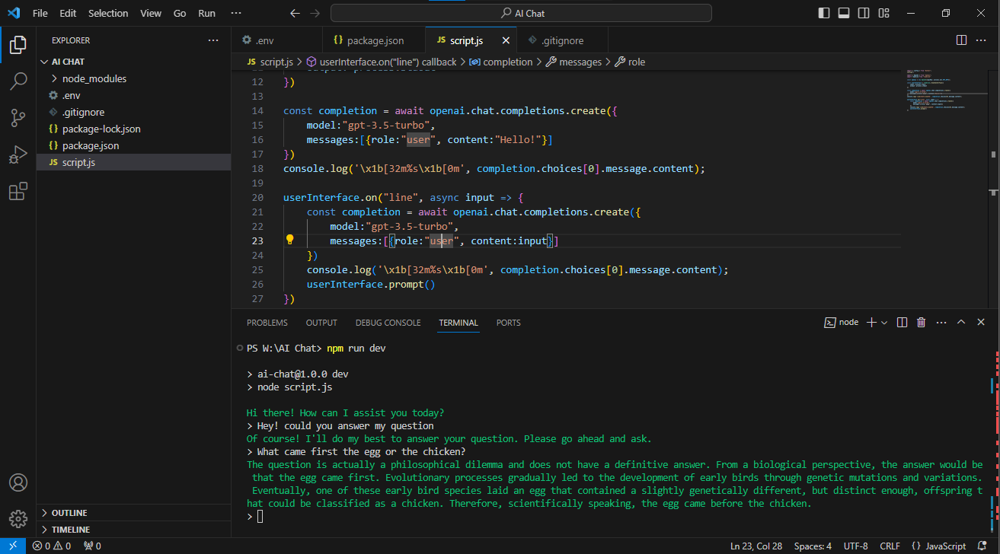

# AI-Terminal

AI chat assistant using OpenAI’s ChatGPT 3.5 Turbo API

Download the.zip folder / unzip and open in IDE.

1. in root folder ; npm install
2. node create.js
3. cd output/ai-terminal
4. add open ai api key to.env and save.
5. npm install openai
6. node script.js                                        // the ai will appear in your terminal.
7. kiss goodbye to complex frameworks with 'genesis'.   // ask open ai gpt 3.5 a question and press return.

double click index.html for our 'thank you!'.    // optional.

(NOTE: The final 'ai-terminal' folder that you navigated to , ' output/ai-terminal' is your working repo.
you can jettison the initial folder that you unzipped from github ,along with the 'output'folder after dragging your working repo
to desktop.You are free to use and distribute your new software under apache 2.0 , remember to delete your
api key from your .env file if you do reproduce and distribute.))

          Copyright © 2023 Psico Communications and Blockchain Development.
